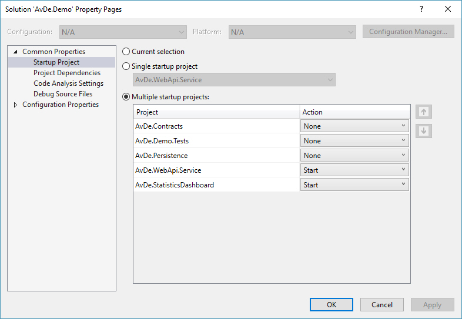
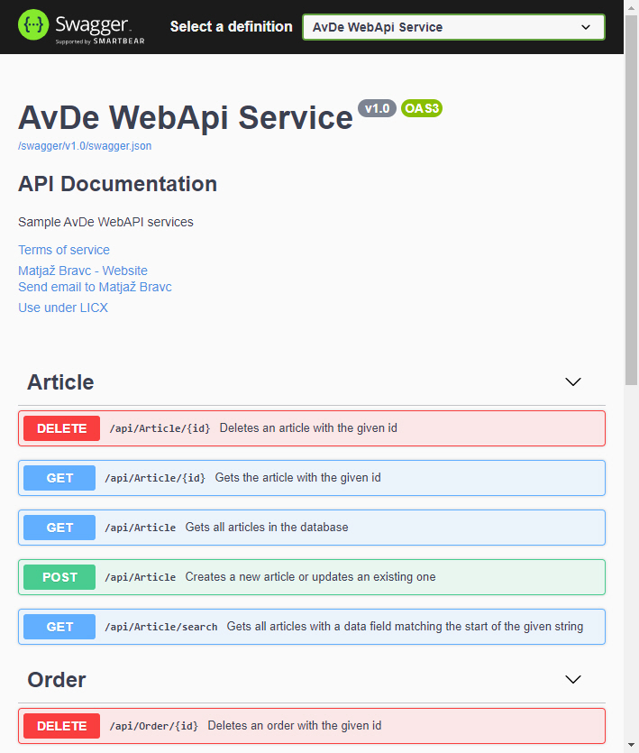
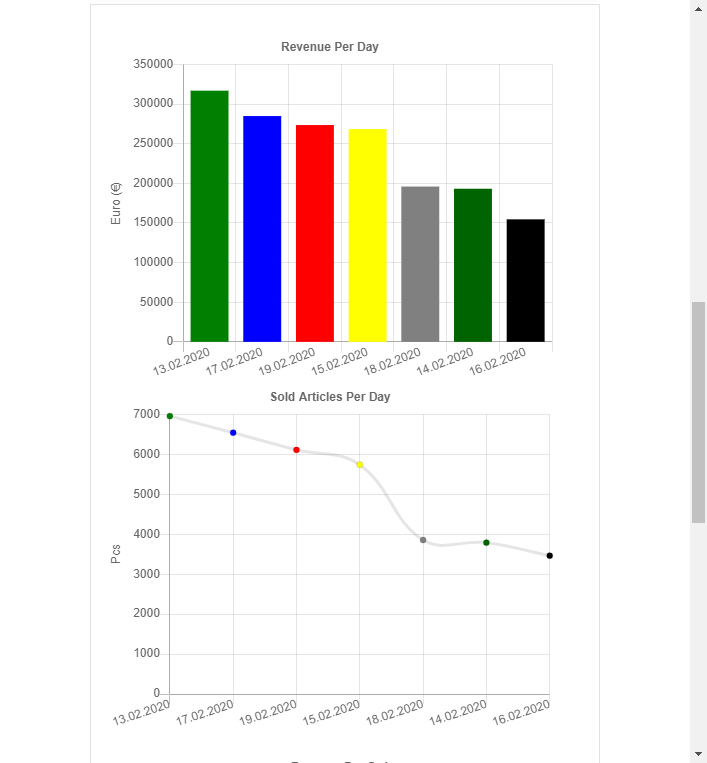
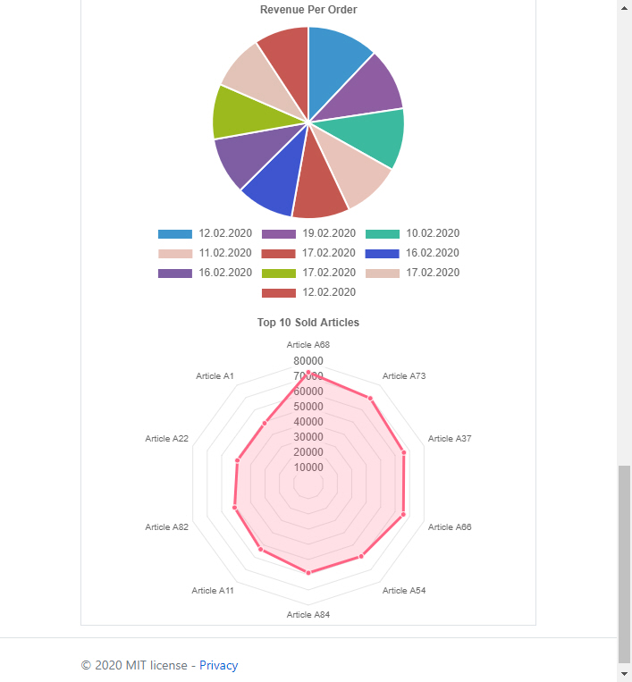

# AvDe Sale Statistics Demo

This solution demonstrates simple Microservice architecture with Web Client based on the most popular Microsoft technologies at this moment and .Net Core is a perfect choice.

This solution demonstrate the following functionalities:
- Usage of ASP.NET Core REST Api Controllers
- [ASP.NET Core 3.1 Razor Pages](https://docs.microsoft.com/en-us/aspnet/core/razor-pages/?view=aspnetcore-3.1&tabs=visual-studio)
- [Chart.js](https://www.chartjs.org/) flexible JavaScript charting
- Global Error Handling
- [Swagger API auto documenting tool](https://swagger.io/)
- Logging with [Serilog](https://serilog.net/) sink to file
- Asynchronous repository Pattern for Entity types
- [In-Memory integration tests](https://docs.microsoft.com/en-us/aspnet/core/test/integration-tests?view=aspnetcore-2.2) with Entity Framework Core
- Unit & integration Tests ([xUnit](https://xunit.github.io/))

## Prerequisites
- [Visual Studio](https://www.visualstudio.com/vs/community) 2019 16.4.5 or greater
- [.NET Core SDK 3.1](https://dotnet.microsoft.com/download/dotnet-core/3.1)

## Tags & Technologies
- [ASP.NET Core 3.1](https://docs.microsoft.com/en-us/aspnet/?view=aspnetcore-3.1#pivot=core)
- [ASP.NET Core 3.1 Razor Pages](https://docs.microsoft.com/en-us/aspnet/core/razor-pages/?view=aspnetcore-3.1&tabs=visual-studio)
- [Entity Framework Core 3.1](https://docs.microsoft.com/en-us/ef/core/)
- [Chart.js](https://www.chartjs.org/)

## Getting Started

**Note: Build solution and configure it to run multiple projects at the same time like this:**

## REST WebApi UI
REST API is documented with Swagger. It includes a UI to explore and test operations, directly from your routes, controllers and models:

## WebApi Razor Client
For a Web Client are used ASP.NET Core Razor Pages which can make coding page-focused scenarios easier and more productive than using controllers and views:

For Statistics Charts I'm using open source [Chart.js](https://www.chartjs.org/) JavaScript charting library:

It's easy to get started with Chart.js. All that's required is the script included in your page along with a single canvas node to render the chart.

Have fun!

## Licence
Licenced under [MIT](http://opensource.org/licenses/mit-license.php).
Contact me on [LinkedIn](https://si.linkedin.com/in/matjazbravc).
